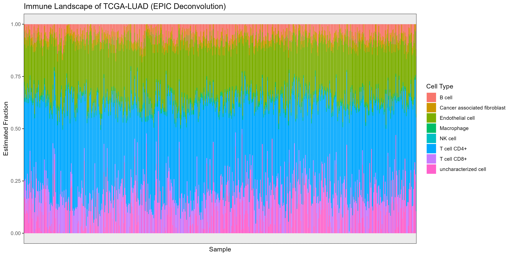

# ImmunoLandscape-TCGA-LUAD
Tumor microenvironment deconvolution using RNA-seq data from TCGA-LUAD.
## ImmunoLandscape: TCGA-LUAD Immune Microenvironment Pipeline

This project analyzes the immune microenvironment of lung adenocarcinoma (LUAD) using transcriptional profiling and immune deconvolution.

### Overview

- **Cohort:** TCGA-LUAD (The Cancer Genome Atlas)
- **Data:** RNA-seq (STAR - Counts), Clinical metadata
- **Goal:** Infer immune cell type proportions in tumor samples

---

### Pipeline Steps

✅ **1. Download & preprocess RNA-seq data**  
[`scripts/download_tcga_data.R`](scripts/download_tcga_data.R)

- Download TCGA-LUAD RNA-seq raw counts (STAR - Counts)
- Normalize to log2 CPM (logCPM)
- Save `TCGA_LUAD_logCPM.csv`

✅ **2. Prepare input for immune deconvolution**  
[`scripts/format_for_cibersortx.R`](scripts/format_for_cibersortx.R)

- Format logCPM matrix for deconvolution
- Save `TCGA_LUAD_logCPM_CIBERSORTx.tsv`

✅ **3. Run immune deconvolution (local option)**  
[`scripts/run_immunedeconv.R`](scripts/run_immunedeconv.R)

- Run immune deconvolution locally using [`immunedeconv`](https://github.com/icbi-lab/immunedeconv)
- Methods supported: CIBERSORT ABS, EPIC, quanTIseq, xCell, MCP-counter
- Save `Immunedeconv_CIBERSORT_ABS.csv`

✅ **4. Visualize immune landscape**  
[`scripts/process_cibersortx_output.R`](scripts/process_cibersortx_output.R)

- Generate stacked barplot of immune cell proportions per tumor
- Save `figures/TCGA_LUAD_ImmuneLandscape_Barplot.png`

---

### Notes

- This project currently supports **fully local analysis** (no CIBERSORTx registration required).
- You can optionally run the pipeline using CIBERSORTx online if an academic email is available.
- The `immunedeconv` package provides several state-of-the-art deconvolution methods.

---

### Example Output

---

### References

- [CIBERSORTx](https://cibersortx.stanford.edu/)
- [TCGAbiolinks R package](https://bioconductor.org/packages/release/bioc/html/TCGAbiolinks.html)
- [immunedeconv R package](https://github.com/icbi-lab/immunedeconv)

---

### License

For non-commercial academic use only.

---

